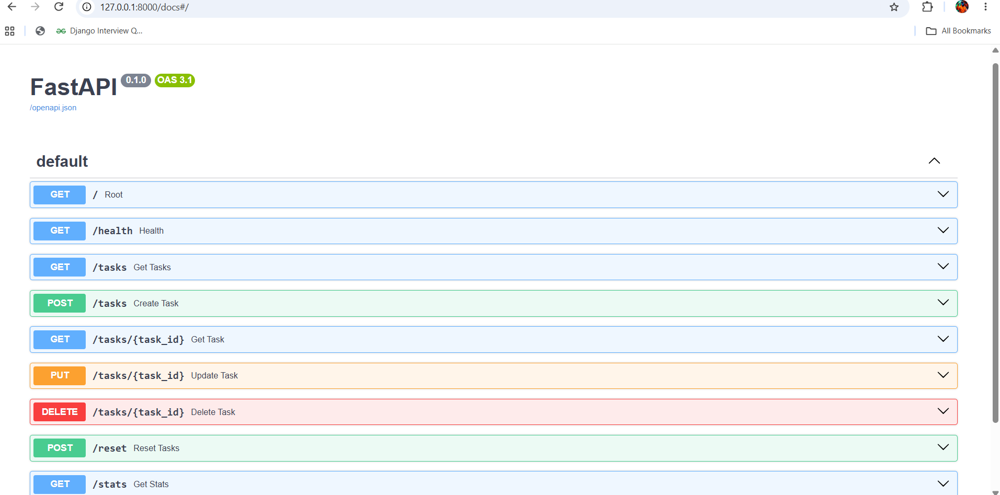

# Task API

A simple **CRUD REST API built with Python and FastAPI**.

This project is part of the Backend Track assignment and demonstrates the basic operations of a backend API using an **in-memory Python list instead of a database**.

The API supports:

* Creating tasks
* Reading all tasks
* Reading a single task
* Updating tasks
* Deleting tasks
* Input validation
* Filtering tasks
* Searching tasks
* Task statistics
* Resetting tasks
* Interactive Swagger UI documentation

Because the tasks are stored only in memory, the data is lost whenever the server is restarted.

---

## Tech Stack

* **Python**
* **FastAPI**
* **Pydantic**
* **Uvicorn**
* **Swagger UI / OpenAPI**

---

## Installation & Run

### 1. Install dependencies

Create and activate a virtual environment if you haven't already.

```bash
python -m venv venv
```

Activate it on Windows:

```bash
venv\Scripts\activate
```

Install the required packages:

```bash
pip install fastapi uvicorn
```

### 2. Run the API

From the directory containing `main.py`, run this one documented command:

```bash
uvicorn main:app --reload
```

The API will be available at:

```text
http://localhost:8000
```

---

## Swagger UI

FastAPI automatically provides interactive API documentation through Swagger UI.

Open:

```text
http://localhost:8000/docs
```

From Swagger UI, you can use **Try it out** to create, read, update, and delete tasks without using curl.

### Swagger Screenshot

```markdown

```
The screenshot should show the available endpoints and the **Try it out** buttons.

---

## API Endpoints

| Method | Endpoint             | Description                | Success         |
| ------ | -------------------- | -------------------------- | --------------- |
| GET    | `/`                  | Returns API information    | 200             |
| GET    | `/health`            | Health check               | 200             |
| GET    | `/tasks`             | Returns all tasks          | 200             |
| GET    | `/tasks/{task_id}`   | Returns a single task      | 200 / 404       |
| POST   | `/tasks`             | Creates a new task         | 201             |
| PUT    | `/tasks/{task_id}`   | Updates an existing task   | 200 / 400 / 404 |
| DELETE | `/tasks/{task_id}`   | Deletes a task             | 204 / 404       |
| GET    | `/tasks?done=true`   | Returns completed tasks    | 200             |
| GET    | `/tasks?search=milk` | Searches tasks by title    | 200             |
| GET    | `/stats`             | Returns task statistics    | 200             |
| POST   | `/reset`             | Restores the initial tasks | 200             |

---

## Task Structure

Each task contains:

```json
{
  "id": 1,
  "title": "Learn FastAPI",
  "done": false
}
```

The server automatically generates the `id` and sets `done` to `false` when a new task is created.

---

## Example Requests

### Get all tasks

```bash
curl -i http://localhost:8000/tasks
```

### Get one task

```bash
curl -i http://localhost:8000/tasks/1
```

### Create a task

```bash
curl -i -X POST http://localhost:8000/tasks \
-H "Content-Type: application/json" \
-d "{\"title\":\"Buy milk\"}"
```

### Update a task

```bash
curl -i -X PUT http://localhost:8000/tasks/1 \
-H "Content-Type: application/json" \
-d "{\"title\":\"Learn FastAPI properly\"}"
```

### Delete a task

```bash
curl -i -X DELETE http://localhost:8000/tasks/1
```

---

## Pasted curl -i Output

Example of creating a task:

```text
$ curl -i -X POST http://localhost:8000/tasks -H "Content-Type: application/json" -d "{\"title\":\"Buy milk\"}"

HTTP/1.1 201 Created
content-type: application/json

{
    "id": 4,
    "title": "Buy milk",
    "done": false
}
```

The `201 Created` status confirms that the task was successfully created.

---

## Query Parameters

### Filter by completion status

Get completed tasks:

```bash
curl -i "http://localhost:8000/tasks?done=true"
```

Get unfinished tasks:

```bash
curl -i "http://localhost:8000/tasks?done=false"
```

### Search tasks

Search for tasks containing `milk` in the title:

```bash
curl -i "http://localhost:8000/tasks?search=milk"
```

Search is case-insensitive.

---

## Statistics

The `/stats` endpoint calculates information from the current task list.

```bash
curl -i http://localhost:8000/stats
```

Example:

```json
{
    "total": 7,
    "done": 3,
    "open": 4
}
```

---

## Reset

The reset endpoint restores the original three example tasks:

```bash
curl -i -X POST http://localhost:8000/reset
```

This is useful when testing the API repeatedly.

---

## In-Memory Storage

This API does not use a database. Tasks are stored in a Python list while the server is running.

For example:

```python
tasks = [
    {"id": 1, "title": "Learn FastAPI", "done": False},
    {"id": 2, "title": "Build CRUD API", "done": False},
    {"id": 3, "title": "Learn Swagger UI", "done": True}
]
```

### Mortality Experiment

Tasks created during runtime disappear when the server is restarted because the API stores them only in an in-memory Python list. When the application starts again, the list is recreated from the original three example tasks.

---

## HTTP Status Codes

| Status Code | Meaning                                   |
| ----------- | ----------------------------------------- |
| 200         | Request successful                        |
| 201         | Task successfully created                 |
| 204         | Task successfully deleted                 |
| 400         | Invalid or empty input                    |
| 404         | Task with the requested ID does not exist |

---

## Project Structure

```text
task-api/
│
├── main.py
└── README.md
```

---

## Running the Project

After installing the dependencies, run:

```bash
uvicorn main:app --reload
```

Then visit:

```text
http://localhost:8000/docs
```

to interact with the API through Swagger UI.
